# Gem


[](https://codecov.io/gh/whanyu1212/gem-dota)


[](https://pypi.org/project/gem-dota/)
[](https://pypi.org/project/gem-dota/)
[](https://github.com/sponsors/whanyu1212)

**Gem of True Sight** — a Python Dota 2 replay parser.

Reads Source 2 `.dem` binary replay files and exposes structured output: per-tick hero state, combat events, ward placements, smoke usage, Roshan kills, gold/XP timelines, draft picks/bans, courier state, ability levels, and more.

---

## Why Gem?

“Gem” is inspired by **Gem of True Sight** in Dota — something that reveals what is normally hidden. Replays are dense binary data; this library aims to surface that hidden information in a form people can actually work with.

We built `gem` in **Python** because most people in data, ML, and AI workflows already live in Python ecosystems. Go/Java parsers are excellent, but they are often not the first language for this audience. The goal is to democratize replay parsing: make it approachable from scratch, easy to inspect, and simple to plug into notebooks, pandas, and ML pipelines.

There is also a practical high-MMR reason: once your MMR is around **8500+**, ranked games are typically **Immortal Draft**, and many matches become effectively private to public stats ecosystems. In those cases, services like OpenDota, Dotabuff, and STRATZ often cannot parse or expose the game through normal API flows, so the most reliable path for serious self-review is parsing your own replays (or replays shared by trusted friends/pro teammates).

Another core reason is data ownership and transparency. API/GraphQL outputs from sites like OpenDota and STRATZ are already processed interpretations, which can involve information loss and hidden assumptions. With `gem`, we want to help people understand replay parsing from first principles in a user-friendly, widely adopted language, with an implementation that is open source and inspectable end-to-end. Skadistats once open-sourced SMOKE years ago (Cython-based rather than pure Python), but it is no longer maintained; `gem` aims to help fill that gap for today’s Python/data community.

---

## Installation

Requires Python 3.10+.

### Install from PyPI

```bash
# pip
pip install gem-dota

# poetry
poetry add gem-dota

# uv (project dependency)
uv add gem-dota
```

### Development / Contributing setup

```bash
git clone https://github.com/whanyu1212/gem-dota
cd gem
uv sync --group dev
```

> **Note:** Most users do not need to download hero/item icon assets. Icon fetching is only required for local report/example rendering that displays portraits or item/rune icons.

---

## Quick start

```python
import gem

match = gem.parse("my_replay.dem")

# Draft — who was picked and banned?
for event in match.draft:
    action = "PICK" if event.is_pick else "BAN"
    print(f"{action}: {gem.constants.hero_display(event.hero_name)}")

# Per-player summary
for player in match.players:
    print(
        f"{player.player_name} ({gem.constants.hero_display(player.hero_name)}): "
        f"{player.kills}/{player.deaths}/{player.assists}  "
        f"{player.net_worth_t_min[-1] if player.net_worth_t_min else 0:,} NW  "
        f"{player.stuns_dealt:.1f}s stuns"
    )

# Look up a specific player by hero name (display name, NPC name, or bare suffix)
axe    = gem.find_player(match, "Axe")
am     = gem.find_player(match, "Anti-Mage")
sf     = gem.find_player(match, "npc_dota_hero_nevermore")
if axe:
    print(f"Axe: {axe.kills}/{axe.deaths}/{axe.assists}")
```

```python
# Parse to DataFrames
dfs = gem.parse_to_dataframe("my_replay.dem")
players   = dfs["players"]     # one row per player per sample tick
positions = dfs["positions"]   # one row per (player, tick) with x/y coords
combat    = dfs["combat_log"]  # all combat log entries
wards     = dfs["wards"]       # ward placements
```

```python
# Parse to JSON
json_str = gem.parse_to_json("my_replay.dem", indent=2)

# Or convert an already-parsed match
match = gem.parse("my_replay.dem")
json_str = gem.to_json(match)
data     = gem.to_dict(match)  # plain Python dict
```

```python
# Export all DataFrames to Parquet files (one file per table)
paths = gem.parse_to_parquet("my_replay.dem", output_dir="./parquet_out")

# Or export from an already-parsed match
paths = gem.to_parquet(match, output_dir="./parquet_out")
```

### CLI

`gem` ships with a command-line interface for quick inspection, export, and batch processing:

```bash
# Print a match summary
python -m gem match.dem

# Export to JSON (stdout or file)
python -m gem match.dem --format json
python -m gem match.dem --format json --output out.json

# Export all tables to Parquet
python -m gem parse match.dem --format parquet --output ./parquet_out

# Parse a whole folder in parallel (one Parquet subdir per replay)
python -m gem batch replays/ --format parquet --output ./out --workers 4

# Concatenate all replays into one set of DataFrames
python -m gem batch replays/ --format dataframe --output ./out

# Show live progress and a timing breakdown
python -m gem match.dem --progress --timings
```

<p align="center">
  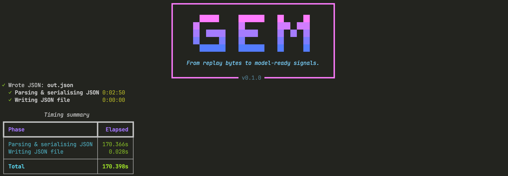
</p>

---

## Showcase — what you can do today

`gem` can power a full match analysis workflow out of the box, including:
- overview dashboards,
- combat and teamfight breakdowns,
- vision timelines/maps,
- economy progression,
- draft + objectives + chat context,
- movement trails and time-series graphs.

### Report screenshots

<table width="100%" style="table-layout:fixed;border-collapse:separate;border-spacing:8px 8px;">
  <tr>
    <td align="center" valign="top" width="33.33%">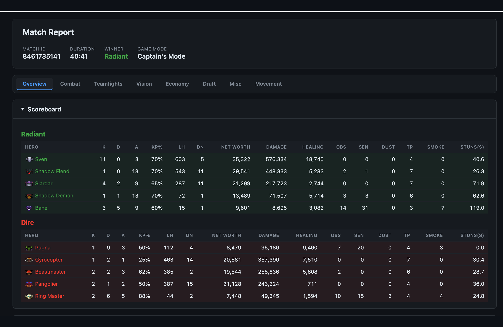<br><sub>Overview</sub></td>
    <td align="center" valign="top" width="33.33%">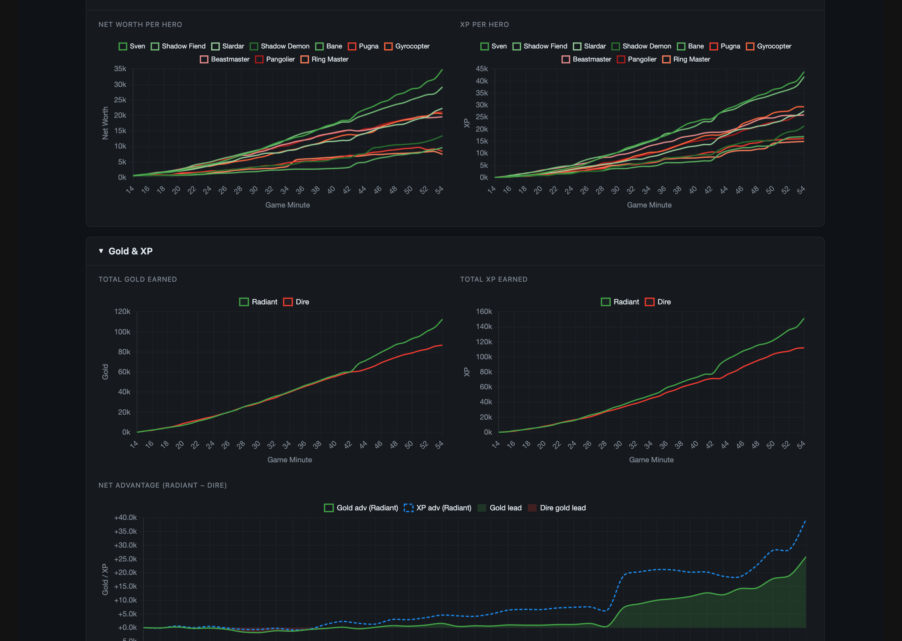<br><sub>Gold / XP</sub></td>
    <td align="center" valign="top" width="33.33%">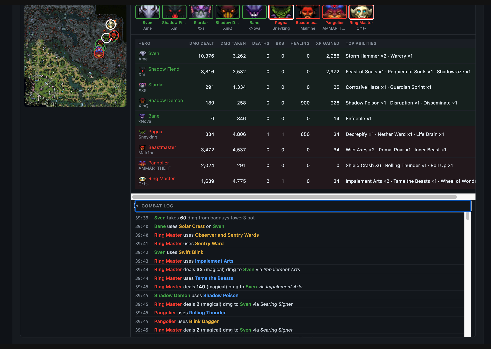<br><sub>Fight Breakdown & Combat</sub></td>
  </tr>
  <tr>
    <td align="center" valign="top" width="33.33%">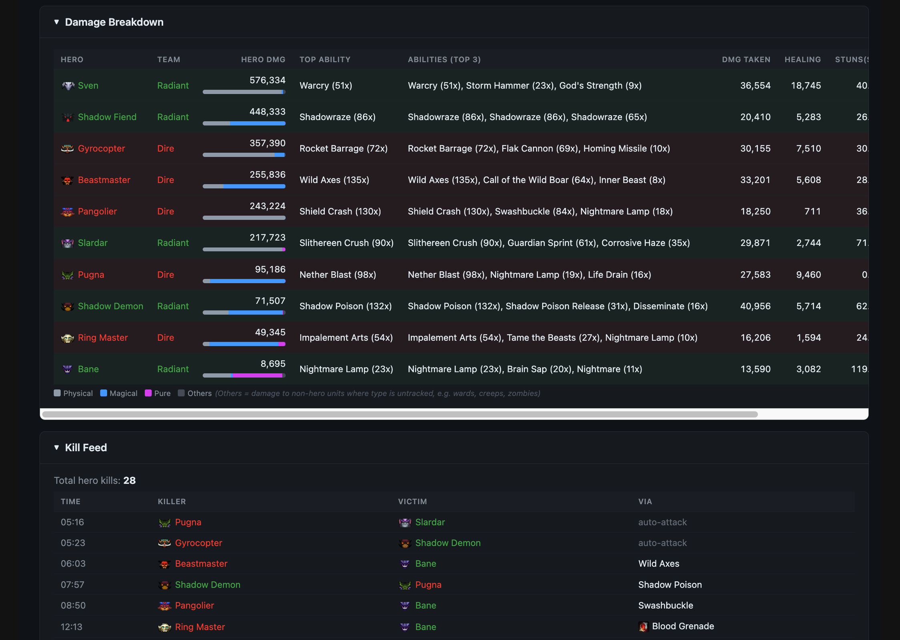<br><sub>Damage Breakdown</sub></td>
    <td align="center" valign="top" width="33.33%">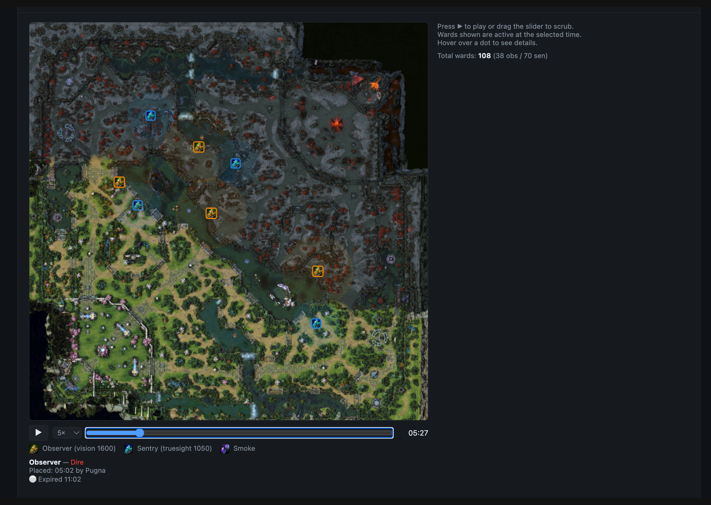<br><sub>Interactive Vision Map</sub></td>
    <td align="center" valign="top" width="33.33%">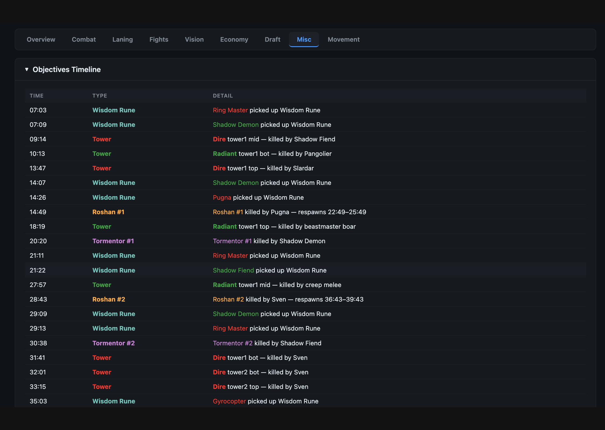<br><sub>Objective Timeline</sub></td>
  </tr>
  <tr>
    <td align="center" valign="top" width="33.33%">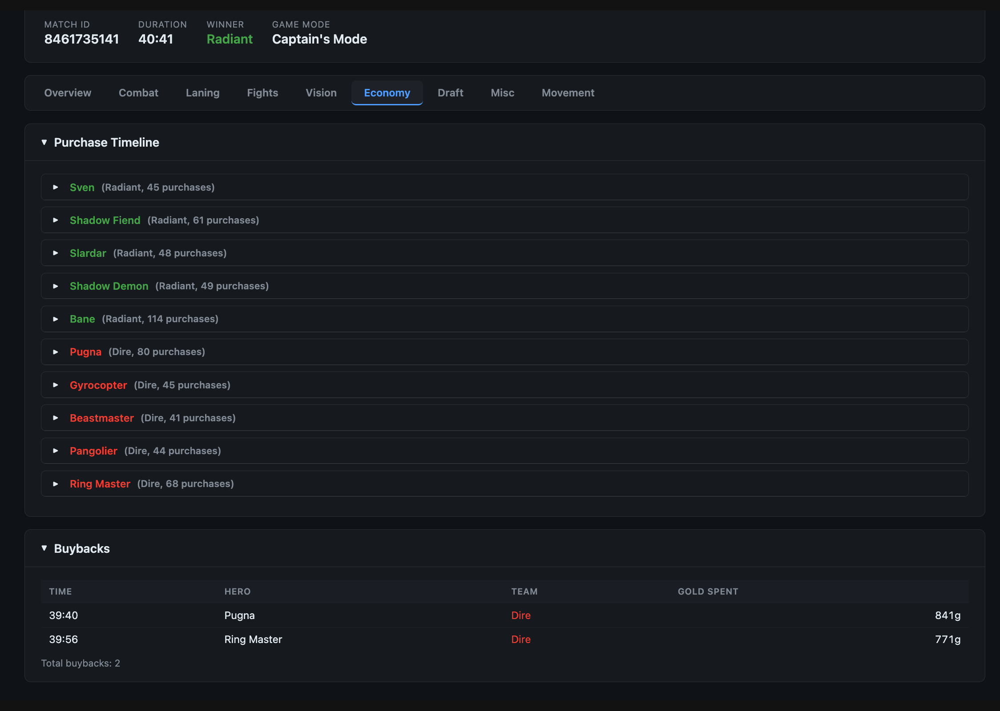<br><sub>Purchase Log & Buybacks</sub></td>
    <td align="center" valign="top" width="33.33%">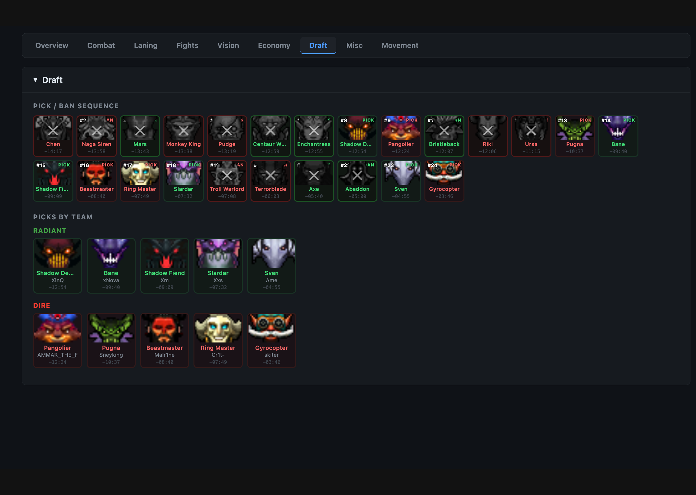<br><sub>Draft Summary</sub></td>
    <td align="center" valign="top" width="33.33%">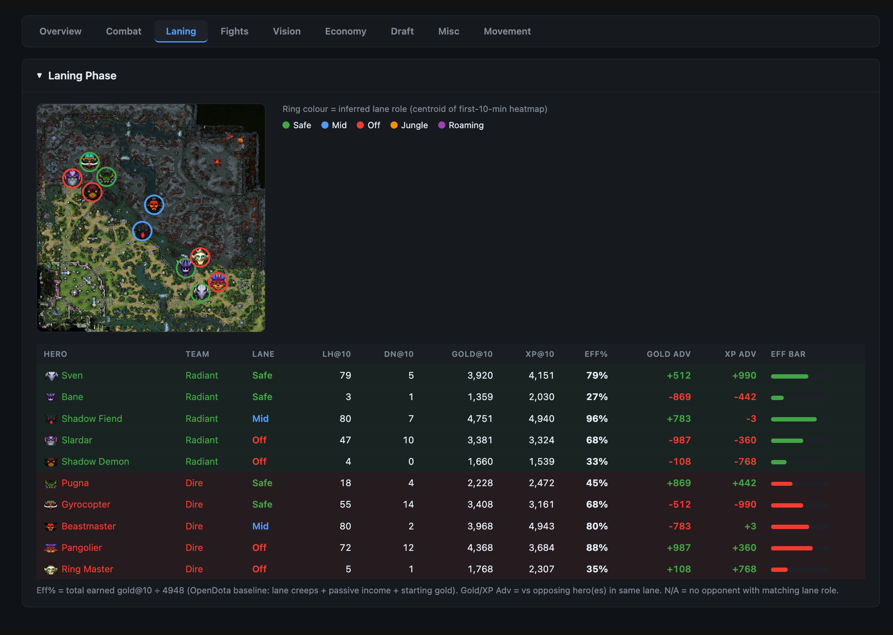<br><sub>Laning Efficiency</sub></td>
  </tr>
</table>

<p align="center">
  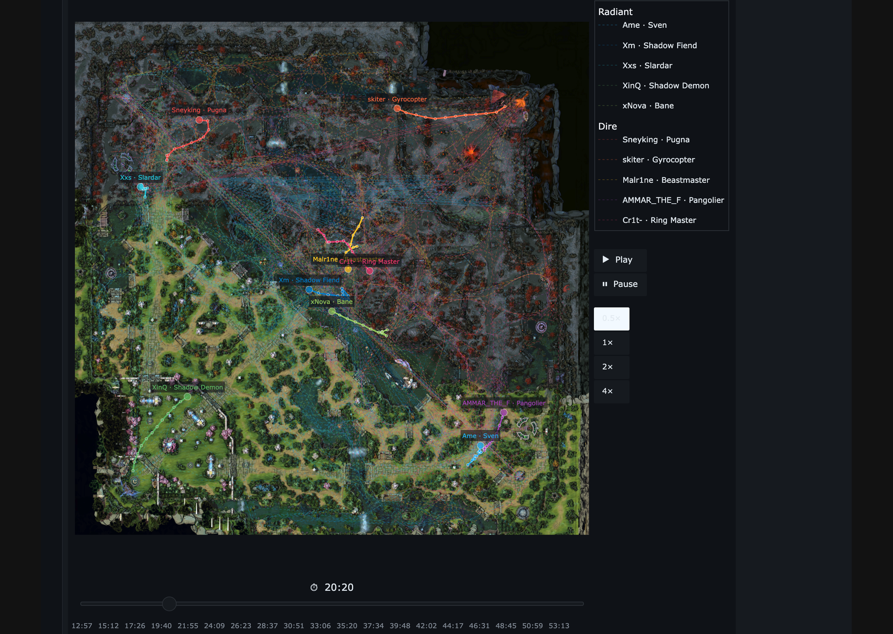<br>
  <sub>Interactive Movement Trail</sub>
</p>

### Reproduce this analysis

A sample report (TI14 Grand Finals G3 — XG vs Falcons) is available as a download from the docs site:
[whanyu1212.github.io/gem-dota/reports/](https://whanyu1212.github.io/gem-dota/reports/)

Run the match report generator in `examples/`:

```bash
uv run python examples/match_report.py path/to/your_replay.dem
```

By default it writes `<replay_stem>_report.html` to the project root.

---

## Expected output of `gem.parse(dem_path)`

`gem.parse(dem_path)` returns a **`ParsedMatch`** object — a structured, analysis-ready view of the replay.

High-level shape:
- **Match metadata**: match ID, timing/tick context, and global match-level fields.
- **Players (`match.players`)**: one `ParsedPlayer` per player with summary stats (K/D/A, damage, net worth, stuns, logs) plus time-series snapshots.
- **Timeline/event collections**: draft events, combat log entries, wards/smokes, Roshan/aegis events, objectives, chat, teamfights, and courier snapshots.
- **Advantage/time-series arrays**: values like radiant gold/XP advantage across game time.

In short: think of `ParsedMatch` as one container holding both **per-player summaries** and **time-ordered match events**, ready for direct Python analysis or conversion via `parse_to_dataframe`.

---

## What you can extract

| Data | API |
|---|---|
| Hero picks and bans with timestamps | `ParsedMatch.draft` |
| Per-player K/D/A + core combat summaries | `ParsedPlayer.kills` / `.deaths` / `.assists` / `.damage` |
| Gold / XP / net-worth time series | `ParsedPlayer.times`, `.gold_t`, `.xp_t`, `.net_worth_t` |
| Minute-aligned economy/XP series | `ParsedPlayer.times_min`, `.total_earned_gold_t_min`, `.total_earned_xp_t_min` |
| Radiant gold / XP advantage curves | `ParsedMatch.radiant_gold_adv` / `.radiant_xp_adv` |
| Ward placements with exact coordinates | `ParsedMatch.wards` |
| Smoke of Deceit activations + grouped heroes | `ParsedMatch.smoke_events` |
| Roshan kills + aegis events | `ParsedMatch.roshans` / `.aegis_events` |
| Tower and barracks kills | `ParsedMatch.towers` / `.barracks` |
| Teamfights with per-player breakdown | `ParsedMatch.teamfights` |
| Courier state snapshots per team | `ParsedMatch.courier_snapshots` |
| Damage by type (physical/magical/pure) | `ParsedPlayer.damage_by_type` / `.damage_taken_by_type` |
| Laning signals (role + lane-phase metrics) | `ParsedPlayer.lane_role`, `.lane_efficiency_pct`, `.lane_gold_adv`, `.lane_xp_adv` |
| Lane position heatmaps | `ParsedPlayer.lane_pos` |
| Stun seconds dealt per player | `ParsedPlayer.stuns_dealt` |
| Per-minute hero damage / healing / deaths / stuns | `ParsedPlayer.total_hero_damage_t_min` / `total_hero_healing_t_min` / `total_deaths_t_min` / `total_stuns_t_min` |
| Rune pickups per player | `ParsedPlayer.runes_log` |
| Buybacks per player | `ParsedPlayer.buyback_log` |
| Chat messages | `ParsedMatch.chat` |
| Purchase log per player | `ParsedPlayer.purchase_log` |
| Vision modifier events (Slardar, BH Track, Dust, Gem) *(experimental)* | `ParsedMatch.vision_modifiers` |
| Vision source estimation per point *(experimental)* | `gem.estimate_vision(match, team, tick, x, y)` |
| Hero / item / ability display names | `gem.constants` |
| Look up a player by hero name | `gem.find_player(match, "Axe")` |

---

## Releases

### [v0.2.6](https://github.com/whanyu1212/gem-dota/releases/tag/v0.2.6)

- **Team identity fields** — `ParsedMatch.radiant_team_id`, `radiant_team_name`, `radiant_team_tag` and `dire_team_id`, `dire_team_name`, `dire_team_tag` extracted from `CDOTATeam` entities. Default to `0`/`""` for pub games.
- **Player Steam/account IDs** — `ParsedPlayer.steam_id` (64-bit) and `ParsedPlayer.account_id` (32-bit, matches OpenDota/Dotabuff URLs) extracted from `CDOTA_PlayerResource`.
- **HTML report scoreboard** — account ID now displayed below each hero name in the scoreboard roster.

### [v0.2.5](https://github.com/whanyu1212/gem-dota/releases/tag/v0.2.5)

- **`gem.fetch_replay(match_id, out_dir)`** — download and decompress a replay from OpenDota in one call. Lower-level helpers `fetch_replay_url` and `download_and_decompress` also exposed via the public API.
- **`gem.resolve_pick_team(event, players)`** — resolves the team for a draft pick/ban using the post-game player roster (more reliable than `m_pGameRules.m_iActiveTeam` in HLTV/coach replays).
- **`gem.net_worth_at(player, tick)`**, **`gem.ward_vision_impact(ward, match)`**, **`gem.is_active_teamfight_participant(player_stats)`**, **`gem.format_npc_name(name)`** — new analysis helpers.
- **Draft fix** — `DraftExtractor._resolve_name()` now correctly halves doubled hero IDs (`api_id * 2`) before falling back to a direct lookup, fixing wrong hero resolution for bans in modern replays.
- **Integration test** — `tests/test_draft_integration.py` verifies picks/bans against the OpenDota API across 5 captains-mode pro replays.
- **Sample report** — TI14 Grand Finals G3 (XG vs Falcons) report available as a download from the [reports gallery](https://whanyu1212.github.io/gem-dota/reports/).

### [v0.2.4](https://github.com/whanyu1212/gem-dota/releases/tag/v0.2.4)

- **Vision modifier tracking** *(experimental)* — `ParsedMatch.vision_modifiers` is a new list of `VisionModifierEvent` records tracking every application of a vision-granting ability or item (Slardar Corrosive Haze, Bounty Hunter Track, Dust of Appearance, Gem of True Sight). Start/end ticks, caster, target, and team are all captured.
- **`gem.estimate_vision(match, team, tick, x, y)`** *(experimental)* — geometry-based vision estimation for a given point at a given tick. Returns a ranked list of `VisionSource` objects covering allied heroes (day/night radius), observer wards, and active vision modifier reveals. See [API reference](docs/reference/analysis.md) for limitations.
- **Ward killer attribution fix** — sentry/observer wards now correctly attribute the killer when the entity lifestate transition and the combat log DEATH event arrive at the same tick (same-tick ordering bug resolved).
- **Fights tab — Active Reveals** — the match report Fights tab now shows which heroes were under vision modifiers (Corrosive Haze, Dust, Track, Gem) during each teamfight window.
- **HTML report size fix** — report file size reduced from ~459 MB to ~58 MB by deduplicating base64 map/icon embeds. Map image (9 MB) was embedded 22× (once per teamfight minimap); hero icons were repeated up to 70× each. Both are now hoisted to JS globals and patched on load.
- **Ward map heatmap y-flip fix** — vision coverage heatmap overlay was rendered upside-down relative to ward dot positions; corrected.
- **Sample report gallery** — TI14 G3 report available as a download at [whanyu1212.github.io/gem-dota/reports/](https://whanyu1212.github.io/gem-dota/reports/).

### v0.2.3

- **Per-minute combat totals** — `total_hero_damage_t_min`, `total_hero_healing_t_min`, `total_deaths_t_min`, `total_stuns_t_min` on `ParsedPlayer`. Monotonically increasing counters; diff any two indices for per-window rates. Targeted at ML feature extraction pipelines.
- **`gem.find_player(match, hero)`** — look up a player by display name, NPC name, or bare suffix without manual iteration.
- **`gem.constants.hero_npc_name(name)`** — reverse lookup from display name (e.g. `"Anti-Mage"`) to NPC name (`"npc_dota_hero_antimage"`).
- **`ParsedMatch.duration_minutes` / `duration_seconds`** — convenience properties for match length.
- **Doc fixes** — quickstart guide and match data guide had several references to nonexistent fields; all corrected and verified with a runnable `examples/quickstart.py`.

### [v0.2.2](https://github.com/whanyu1212/gem-dota/releases/tag/v0.2.2)

- **Batch processing** — `gem.parse_many()`, `gem.parse_many_to_dataframe()`, `gem.parse_many_to_parquet()` for parallel multi-replay parsing via `ProcessPoolExecutor`.
- **CLI `batch` subcommand** — `python -m gem batch replays/ --format parquet --output ./out`; legacy bare-path invocation preserved.
- **Docs** — home page feature cards, annotated JSON output guide (real TI14 G3 XG vs Falcons replay), CLI reference guide, batch API reference page.

### [v0.2.1](https://github.com/whanyu1212/gem-dota/releases/tag/v0.2.1)

- **JSON export** — `gem.to_json()`, `gem.to_dict()`, `gem.parse_to_json()` added to the public API.
- **Parquet export** — `gem.to_parquet()`, `gem.parse_to_parquet()` added (requires `pyarrow` or `fastparquet`).
- **Rich CLI** — live progress bar, timing summary, pixel-art banner in a box, Radiant/Dire colour-coded summary table.
- **Docs** — architecture page redesigned, diamond icon, laning pages added to nav, export formats documented throughout.
- **Bug fixes** — two `mypy` type errors resolved in `__main__.py` and `dataframes.py`.

### [v0.2.0](https://github.com/whanyu1212/gem-dota/releases/tag/v0.2.0)

- **Buyback gold cost** — HTML report buyback table now shows gold spent per buyback using the exact Dota 2 formula `floor(200 + net_worth / 13)`.
- **Removed `ParsedMatch.lotus_pickups`** — healing lotus pickups are not recorded in the `.dem` combat log under any event type; the field always returned an empty list and has been removed (breaking change).
- **Known limitations documented** — healing lotus (not parseable from replays) and reliable vs unreliable gold distinction added to README.
- **Repo URL fixes** — all links corrected from `whanyu1212/gem` to `whanyu1212/gem-dota`.
- **Test coverage expanded** — teamfight helpers, `_dedup_purchase_log` edge cases, HEAL/gold/XP attribution.
- **Screenshot refresh** — all report screenshots updated and resized to uniform dimensions.

### [v0.1.1](https://github.com/whanyu1212/gem-dota/releases/tag/v0.1.1)

- **Laning** — lane role detection, lane-phase gold/XP efficiency metrics, and positional heatmaps per player (`ParsedPlayer.lane_role`, `.lane_efficiency_pct`, `.lane_gold_adv`, `.lane_xp_adv`, `.lane_pos`).
- **Damage type breakdown** — physical / magical / pure damage split for both dealt and taken (`ParsedPlayer.damage_by_type`, `.damage_taken_by_type`).
- **Aghanim's Scepter/Shard abilities** — extended ability metadata and correct parsing of Aghs-upgraded abilities.
- **Teamfight detection** — switched to pure temporal windowing; spatial centroid splitting removed for consistency.

### [v0.1.0](https://github.com/whanyu1212/gem-dota/releases/tag/v0.1.0)

- **Initial public release** of `gem-dota`.
- Full Source 2 `.dem` parser pipeline — stream decoding, send tables, field paths, entity delta system, string tables.
- Game events and combat log ingestion (Source 1 legacy + Source 2 HLTV paths).
- Extractors: players (gold/XP/net worth time series, K/D/A, stuns), objectives (towers, barracks, Roshan, Tormentor), wards (with exact coordinates), courier, draft, teamfights.
- Rune pickups, buybacks, aegis events, smoke groups, chat, purchase log.
- `ParsedMatch` / `ParsedPlayer` output models, DataFrame export, and CLI.
- HTML match report example (draft, combat, vision, economy, teamfights, movement).

---

## Components

| Component | Description |
|---|---|
| `reader.py` | `BitReader` — LSB-first bit reading, varint decoding, all binary primitives |
| `stream.py` | `DemoStream` — outer message loop, Snappy decompression, magic check |
| `sendtable.py` | Schema layer — serializer + field tree parsed from `CDemoSendTables` |
| `field_decoder.py` | Type-dispatch decoders including quantized floats |
| `field_path.py` | Huffman-coded field path ops for addressing into the serializer tree |
| `field_state.py` | Nested mutable field-value tree for entity state storage |
| `field_reader.py` | Field decoder dispatch and entity field reading |
| `string_table.py` | Incremental key-history string tables |
| `entities.py` | Entity create/update/delete lifecycle and state |
| `game_events.py` | Game event schema and typed dispatch |
| `combatlog.py` | S1 (game event) and S2 (user message) combat log ingestion |
| `parser.py` | Top-level orchestrator wiring all subsystems together |
| `match_builder.py` | Assembles final `ParsedMatch` output from extractors/aggregates |
| `combat_aggregator.py` | Combat-log aggregation for per-player damage/healing/items/economy stats |
| `models.py` | `ParsedMatch` / `ParsedPlayer` output dataclasses |
| `constants.py` | Bundled hero, item, ability display names |
| `extractors/` | Per-tick polling of entity state — players, lane, objectives, wards, courier, draft, teamfights |
| `dataframes.py` | DataFrame export from `ParsedMatch` |

---

## Examples

```bash
# Comprehensive HTML analysis report (draft, combat, vision, economy, movement, etc.)
python examples/match_report.py path/to/your.dem

# Full replay summary — combat log + entity snapshots (developer-oriented baseline)
python examples/extraction_demo.py path/to/your.dem

# Match info from Steam API (requires STEAM_API_KEY env var)
python examples/steam_match_info.py <match_id>
```

`examples/ti14_sample.json` — annotated real JSON output from TI14 Grand Finals G3 (XG vs Falcons), used as the reference example in the docs.

---

## Documentation

VitePress docs (concepts guide, API reference, architecture diagrams, replay parser tab):

```bash
cd docs
npm install
npm run docs:dev
```

Or visit the hosted docs at [whanyu1212.github.io/gem-dota](https://whanyu1212.github.io/gem-dota/).

Topics covered: DEM binary format, Protocol Buffers, varint encoding, the entity delta system, field paths, combat log ingestion, and more.

---

## AI-Assisted Development

If you use AI coding tools, see [CLAUDE.md](CLAUDE.md) and [AGENTS.md](AGENTS.md) for project context, architecture, and coding conventions.

Use AI as acceleration, not substitution: take ownership of what you submit. Understand the code, run tests, and avoid shipping unreviewed AI slop.

---

## Performance & benchmarking (cross-language)

Replay parsers in **Go** and **Java** are often faster in raw throughput, while `gem` prioritizes **Python-native ergonomics** for data/ML/AI workflows. Our goal is to be fast enough for research/production analysis while remaining easy to inspect, extend, and integrate with pandas/notebooks.

To keep comparisons fair, benchmark parsers with the same:
- replay set (size + patch range),
- extracted outputs (same scope),
- hardware/CPU and OS,
- warmup policy and run count.

> Benchmark results vary heavily by extraction scope (event-only vs full per-tick state), so we recommend reporting both **replays/sec** and **time per replay** with replay sizes.

| Parser | Language | Scope | Throughput (replays/sec) | Notes |
|---|---|---|---:|---|
| gem | Python | Full extraction | TBD | Focused on analytics-first workflows |
| Manta (reference) | Go | TBD | TBD | High-throughput backend-oriented parser |
| Clarity (reference) | Java | TBD | TBD | Mature JVM parser ecosystem |

If you run a benchmark, please open an issue/PR with:
- hardware specs,
- command/config used,
- replay sample list,
- median/p95 numbers.

---

## Known limitations

- **Vision estimation is geometry-only** *(experimental)* — `gem.estimate_vision` and the vision features in the match report use straight-line distance only. Three things are not modelled: (1) high-ground vision penalties — cliff edges block uphill sight; (2) terrain line-of-sight blocking from trees and cliffs (requires a navmesh/walkability grid from `game/dota/pak01_dir.vpk`, which is not bundled); (3) per-hero vision range modifiers from abilities/items (e.g. Aghanim upgrades). Vision results should be treated as approximations.
- **Roshan drops** — Aegis, Cheese, Refresher Shard, and Aghanim's Blessing pickups are not in the combat log. Roshan kills are tracked, but the specific drop items are not.
- **Healing Lotus pickups** — not recorded in the `.dem` combat log under any event type, across all tested patches. The `CDOTA_BaseNPC_LotusPool` entity does not emit per-pickup events either. The lotus count exists in `CMsgDOTAFantasyPlayerStats`, a Steam Game Coordinator message never written into the replay file. While the Steam Web API (`GetMatchDetails`) can provide this as a fallback, it has little practical value here: high-MMR and private matches — the primary audience for `gem` — are often not accessible via the public API, defeating the purpose.
- **Reliable vs unreliable gold** — the combat log `GOLD` entries do not distinguish between reliable gold (from kills, objectives) and unreliable gold (from creep bounties). Only total gold earned per reason code is available.
- **Smoke empty groups** — if a smoke breaks instantly on activation (hero inside sentry truesight), the group list will be empty. This is correct game behaviour, not a parsing gap.
- **Truncated/live replays** — incomplete replays may return partial parsed output (or stop near the final corrupt block) instead of a perfect full-match result.
- **Draft ID quirks** — replay pick/ban IDs can differ from static hero API IDs in some patches/formats (commonly transformed IDs). `gem` normalizes these, but edge cases may still appear.
- **Purchase attribution in spectator/HLTV paths** — purchase events are not always directly hero-attributed in combat log data; reconstruction relies on entity state and may be incomplete in edge cases.
- **Summon ownership edge cases** — most summoned-unit attribution is handled, but complex ownership cases can still produce occasional mismatches.
- **Hero icons** — not bundled in the package. Run `python scripts/fetch_hero_icons.py` to download them locally before using the draft or teamfight report examples.
- **Item icons** — not bundled in the package. Run `python scripts/fetch_item_icons.py` to download them locally before using reports that render item/rune icons.

---

## Acknowledgements

`gem` stands on top of years of open work by the Dota replay community.

- **[Manta](https://github.com/dotabuff/manta)** (Go, MIT) — primary reference for binary parsing logic and the entity delta system.
- **[Clarity](https://github.com/skadistats/clarity)** (Java, BSD 3-Clause) — correctness authority for edge cases and the two-path combat log design.
- **[OpenDota parser](https://github.com/odota/parser)** (Java, MIT) — output schema authority for match data structure and conventions.
- **[dotaconstants](https://github.com/odota/dotaconstants)** (MIT) — hero, item, and ability metadata bundled as static assets.
- **Valve** for the Dota 2 replay ecosystem and continuously evolving game data surface.

No source code was copied from any of the above projects. They were used as reference implementations to understand protocol behaviour, verify correctness, and inform design decisions. All `gem` code is an independent Python reimplementation.

See [`THIRD_PARTY_LICENSES`](THIRD_PARTY_LICENSES) for full license texts.

---

## Roadmap

| Item | Status |
|---|---|
| Validation harness against OpenDota-style outputs | Ongoing |
| Docs expansion (cookbook + parsing-from-scratch walkthroughs) | Planned |
| ML project — using parsed replay data to power supervised/unsupervised models for player and team performance analysis | Planned |
| Agentic project — LLM-powered replay analysis agent that reasons over structured match data to generate insights and coaching feedback | Planned |
| Frontend demo application (interactive replay analysis UI showcasing parser capabilities) | Planned |
| Rust acceleration for selected hot paths (PyO3 + maturin) | Deferred |
