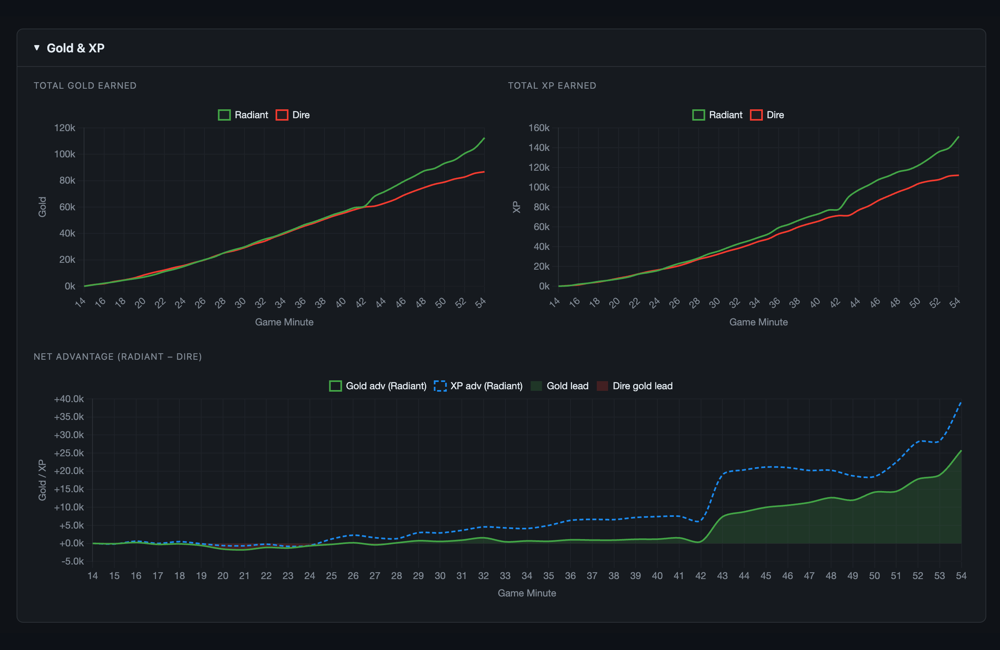
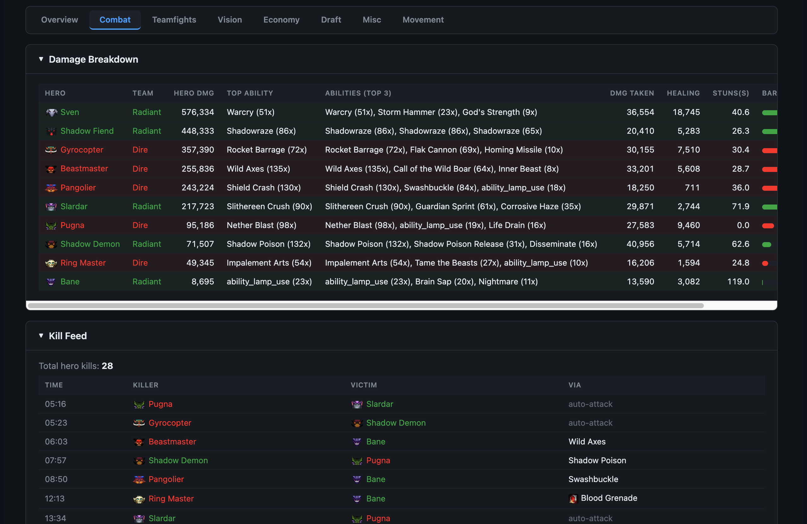
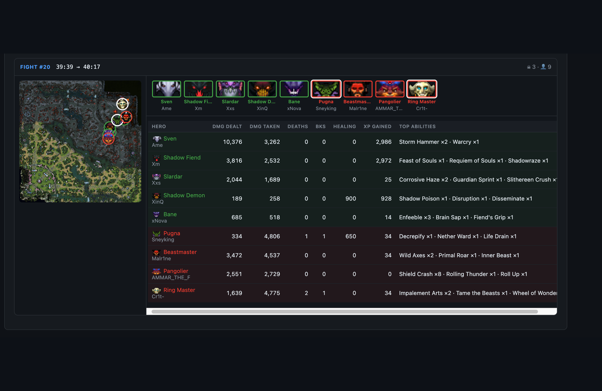
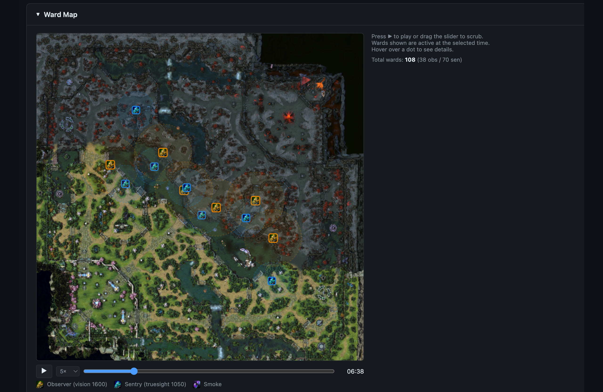
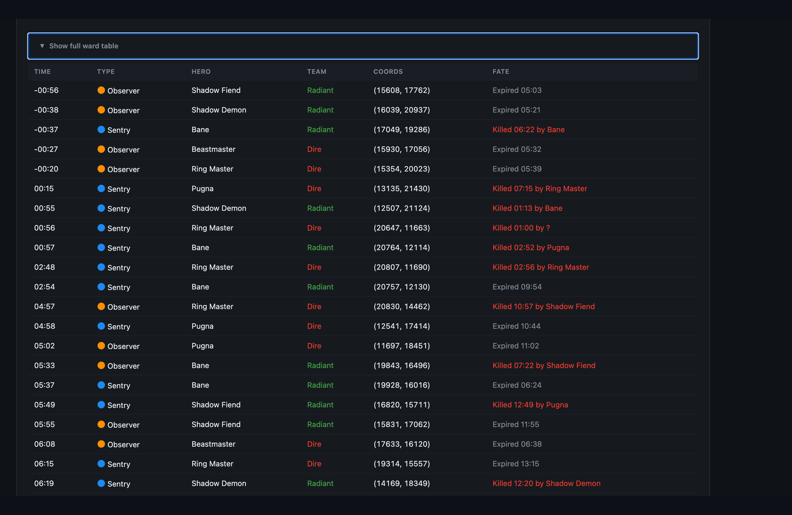
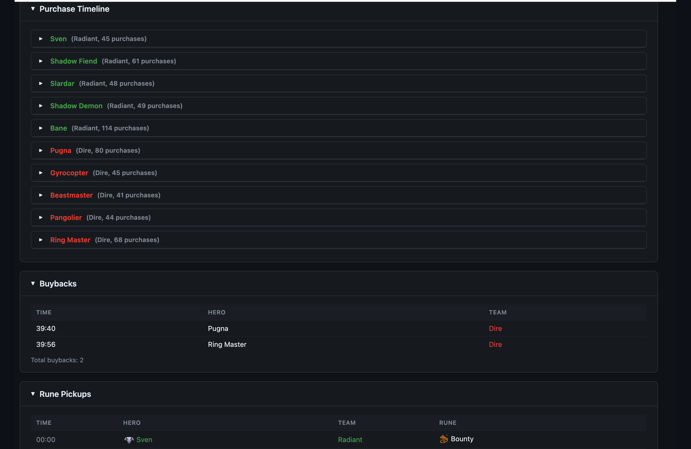
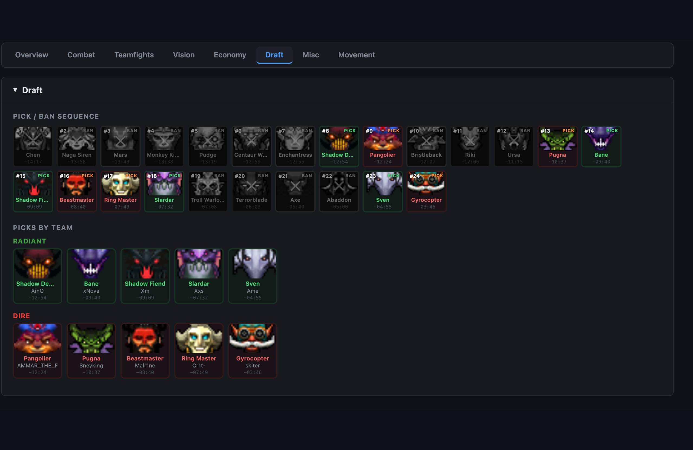
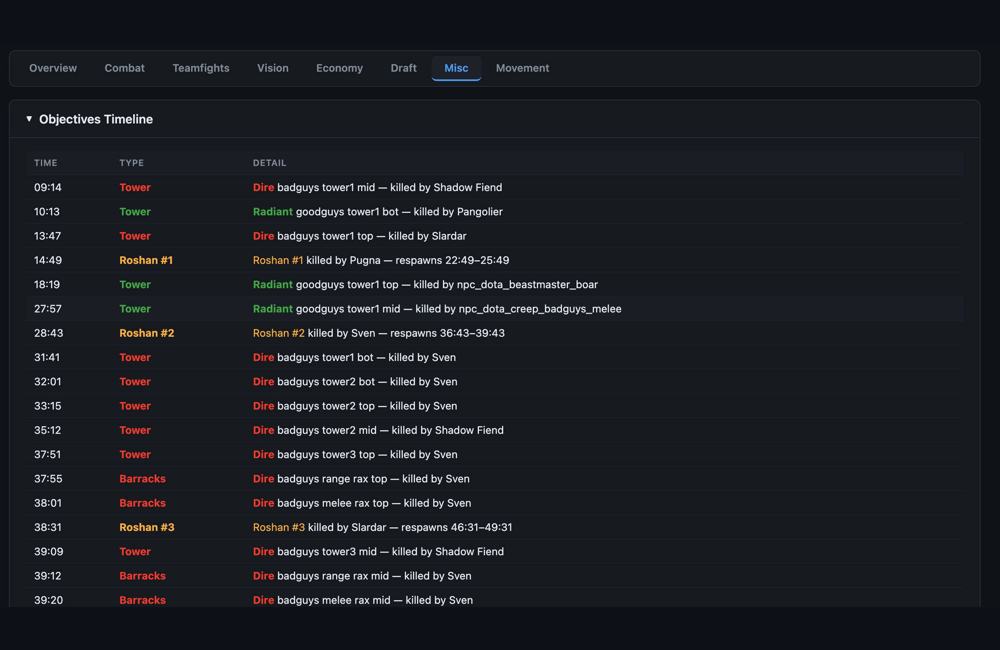

# Gem


[](https://pypi.org/project/gem-dota/)
[](https://pypi.org/project/gem-dota/)
[](https://github.com/sponsors/whanyu1212)

**Gem of True Sight** — a Python Dota 2 replay parser.

Reads Source 2 `.dem` binary replay files and exposes structured output: per-tick hero state, combat events, ward placements, smoke usage, Roshan kills, gold/XP timelines, draft picks/bans, courier state, ability levels, and more.

---

## Why Gem?

“Gem” is inspired by **Gem of True Sight** in Dota — something that reveals what is normally hidden. Replays are dense binary data; this library aims to surface that hidden information in a form people can actually work with.

We built `gem` in **Python** because most people in data, ML, and AI workflows already live in Python ecosystems. Go/Java parsers are excellent, but they are often not the first language for this audience. The goal is to democratize replay parsing: make it approachable from scratch, easy to inspect, and simple to plug into notebooks, pandas, and ML pipelines.

There is also a practical high-MMR reason: once your MMR is around **8500+**, ranked games are typically **Immortal Draft**, and many matches become effectively private to public stats ecosystems. In those cases, services like OpenDota, Dotabuff, and STRATZ often cannot parse or expose the game through normal API flows, so the most reliable path for serious self-review is parsing your own replays (or replays shared by trusted friends/pro teammates).

Another core reason is data ownership and transparency. API/GraphQL outputs from sites like OpenDota and STRATZ are already processed interpretations, which can involve information loss and hidden assumptions. With `gem`, we want to help people understand replay parsing from first principles in a user-friendly, widely adopted language, with an implementation that is open source and inspectable end-to-end. Skadistats once open-sourced SMOKE years ago (Cython-based rather than pure Python), but it is no longer maintained; `gem` aims to help fill that gap for today’s Python/data community.

---

## Installation

Requires Python 3.10+.

### Install from PyPI

```bash
# pip
pip install gem-dota

# poetry
poetry add gem-dota

# uv (project dependency)
uv add gem-dota
```

### Development / Contributing setup

```bash
git clone https://github.com/whanyu1212/gem
cd gem
uv sync --group dev
```

> **Note:** Most users do not need to download hero/item icon assets. Icon fetching is only required for local report/example rendering that displays portraits or item/rune icons.

---

## Quick start

```python
import gem

match = gem.parse("my_replay.dem")

# Draft — who was picked and banned?
for event in match.draft:
    action = "PICK" if event.is_pick else "BAN"
    print(f"{action}: {gem.constants.hero_display(event.hero_name)}")

# Per-player summary
for player in match.players:
    print(
        f"{player.player_name} ({gem.constants.hero_display(player.hero_name)}): "
        f"{player.kills}/{player.deaths}/{player.assists}  "
        f"{player.net_worth:,} NW  {player.stuns_dealt:.1f}s stuns"
    )
```

```python
# Parse to DataFrames
dfs = gem.parse_to_dataframe("my_replay.dem")
players   = dfs["players"]     # one row per player per sample tick
positions = dfs["positions"]   # one row per (player, tick) with x/y coords
combat    = dfs["combat_log"]  # all combat log entries
wards     = dfs["wards"]       # ward placements
```

---

## Showcase — what you can do today

`gem` can power a full match analysis workflow out of the box, including:
- overview dashboards,
- combat and teamfight breakdowns,
- vision timelines/maps,
- economy progression,
- draft + objectives + chat context,
- movement trails and time-series graphs.

### Report screenshots

<table width="100%" style="table-layout:fixed;border-collapse:separate;border-spacing:8px 8px;">
  <tr>
    <td align="center" valign="top" width="33.33%"><br><sub>Overview</sub></td>
    <td align="center" valign="top" width="33.33%"><br><sub>Gold / XP</sub></td>
    <td align="center" valign="top" width="33.33%"><br><sub>Combat</sub></td>
  </tr>
  <tr>
    <td align="center" valign="top" width="33.33%"><br><sub>Teamfight</sub></td>
    <td align="center" valign="top" width="33.33%"><br><sub>Vision Map</sub></td>
    <td align="center" valign="top" width="33.33%"><br><sub>Warding Log</sub></td>
  </tr>
  <tr>
    <td align="center" valign="top" width="33.33%"><br><sub>Economy</sub></td>
    <td align="center" valign="top" width="33.33%"><br><sub>Draft</sub></td>
    <td align="center" valign="top" width="33.33%"><br><sub>Misc</sub></td>
  </tr>
</table>

<p align="center">
  <br>
  <sub>Movement Trail</sub>
</p>

### Reproduce this analysis

Run the match report generator in `examples/`:

```bash
uv run python examples/match_report.py path/to/your_replay.dem
```

By default it writes:
- `<replay_stem>_report.html` in the project root.

---

## Expected output of `gem.parse(dem_path)`

`gem.parse(dem_path)` returns a **`ParsedMatch`** object — a structured, analysis-ready view of the replay.

High-level shape:
- **Match metadata**: match ID, timing/tick context, and global match-level fields.
- **Players (`match.players`)**: one `ParsedPlayer` per player with summary stats (K/D/A, damage, net worth, stuns, logs) plus time-series snapshots.
- **Timeline/event collections**: draft events, combat log entries, wards/smokes, Roshan/aegis events, objectives, chat, teamfights, and courier snapshots.
- **Advantage/time-series arrays**: values like radiant gold/XP advantage across game time.

In short: think of `ParsedMatch` as one container holding both **per-player summaries** and **time-ordered match events**, ready for direct Python analysis or conversion via `parse_to_dataframe`.

---

## What you can extract

| Data | API |
|---|---|
| Hero picks and bans with timestamps | `ParsedMatch.draft` |
| Per-player K/D/A, damage, net worth | `ParsedPlayer.kills` / `.damage` / `.net_worth` |
| Gold and XP over time | `ParsedPlayer.snapshots` |
| Radiant gold / XP advantage curves | `ParsedMatch.radiant_gold_adv` / `.radiant_xp_adv` |
| Ward placements with exact coordinates | `ParsedMatch.wards` |
| Smoke of Deceit activations + groups | `ParsedMatch.wards` (smoke entries) |
| Roshan kills + aegis events | `ParsedMatch.roshans` / `.aegis_events` |
| Tower and barracks kills | `ParsedMatch.towers` / `.barracks` |
| Teamfights with per-player breakdown | `ParsedMatch.teamfights` |
| Courier state snapshots per team | `ParsedMatch.courier_snapshots` |
| Ability levels per hero per tick | `PlayerStateSnapshot.ability_levels` |
| Stun seconds dealt per player | `ParsedPlayer.stuns_dealt` |
| Rune pickups per player | `ParsedPlayer.runes_log` |
| Buybacks per player | `ParsedPlayer.buyback_log` |
| Lane position heatmaps | `ParsedPlayer.lane_pos` |
| Chat messages | `ParsedMatch.chat` |
| Purchase log per player | `ParsedPlayer.purchase_log` |
| Hero / item / ability display names | `gem.constants` |

---

## Components

| Component | Description |
|---|---|
| `reader.py` | `BitReader` — LSB-first bit reading, varint decoding, all binary primitives |
| `stream.py` | `DemoStream` — outer message loop, Snappy decompression, magic check |
| `sendtable.py` | Schema layer — serializer + field tree parsed from `CDemoSendTables` |
| `field_decoder.py` | Type-dispatch decoders including quantized floats |
| `field_path.py` | Huffman-coded field path ops for addressing into the serializer tree |
| `field_state.py` | Nested mutable field-value tree for entity state storage |
| `field_reader.py` | Field decoder dispatch and entity field reading |
| `string_table.py` | Incremental key-history string tables |
| `entities.py` | Entity create/update/delete lifecycle and state |
| `game_events.py` | Game event schema and typed dispatch |
| `combatlog.py` | S1 (game event) and S2 (user message) combat log ingestion |
| `parser.py` | Top-level orchestrator wiring all subsystems together |
| `models.py` | `ParsedMatch` / `ParsedPlayer` output dataclasses |
| `constants.py` | Bundled hero, item, ability display names |
| `extractors/` | Per-tick polling of entity state — players, objectives, wards, courier, draft, teamfights |
| `dataframes.py` | DataFrame export from `ParsedMatch` |

---

## Examples

```bash
# Comprehensive HTML analysis report (draft, combat, vision, economy, movement, etc.)
python examples/match_report.py path/to/your.dem

# Full replay summary — combat log + entity snapshots (developer-oriented baseline)
python examples/extraction_demo.py path/to/your.dem

# Match info from Steam API (requires STEAM_API_KEY env var)
python examples/steam_match_info.py <match_id>
```

---

## Documentation

Full concepts guide, API reference, and architecture diagrams:

```bash
uv run mkdocs serve
```

Or visit the hosted docs at [whanyu1212.github.io/gem-dota](https://whanyu1212.github.io/gem-dota/).

Topics covered: DEM binary format, Protocol Buffers, varint encoding, the entity delta system, field paths, combat log ingestion, and more.

---

## AI-Assisted Development

If you use AI coding tools, see [CLAUDE.md](CLAUDE.md) and [AGENTS.md](AGENTS.md) for project context, architecture, and coding conventions.

Use AI as acceleration, not substitution: take ownership of what you submit. Understand the code, run tests, and avoid shipping unreviewed AI slop.

---

## Performance & benchmarking (cross-language)

Replay parsers in **Go** and **Java** are often faster in raw throughput, while `gem` prioritizes **Python-native ergonomics** for data/ML/AI workflows. Our goal is to be fast enough for research/production analysis while remaining easy to inspect, extend, and integrate with pandas/notebooks.

To keep comparisons fair, benchmark parsers with the same:
- replay set (size + patch range),
- extracted outputs (same scope),
- hardware/CPU and OS,
- warmup policy and run count.

> Benchmark results vary heavily by extraction scope (event-only vs full per-tick state), so we recommend reporting both **replays/sec** and **time per replay** with replay sizes.

| Parser | Language | Scope | Throughput (replays/sec) | Notes |
|---|---|---|---:|---|
| gem | Python | Full extraction | TBD | Focused on analytics-first workflows |
| Manta (reference) | Go | TBD | TBD | High-throughput backend-oriented parser |
| Clarity (reference) | Java | TBD | TBD | Mature JVM parser ecosystem |

If you run a benchmark, please open an issue/PR with:
- hardware specs,
- command/config used,
- replay sample list,
- median/p95 numbers.

---

## Known limitations

- **Roshan drops** — Aegis, Cheese, Refresher Shard, and Aghanim's Blessing pickups are not in the combat log. Roshan kills are tracked, but the specific drop items are not.
- **Smoke empty groups** — if a smoke breaks instantly on activation (hero inside sentry truesight), the group list will be empty. This is correct game behaviour, not a parsing gap.
- **Truncated/live replays** — incomplete replays may return partial parsed output (or stop near the final corrupt block) instead of a perfect full-match result.
- **Draft ID quirks** — replay pick/ban IDs can differ from static hero API IDs in some patches/formats (commonly transformed IDs). `gem` normalizes these, but edge cases may still appear.
- **Purchase attribution in spectator/HLTV paths** — purchase events are not always directly hero-attributed in combat log data; reconstruction relies on entity state and may be incomplete in edge cases.
- **Summon ownership edge cases** — most summoned-unit attribution is handled, but complex ownership cases can still produce occasional mismatches.
- **Hero icons** — not bundled in the package. Run `python scripts/fetch_hero_icons.py` to download them locally before using the draft or teamfight report examples.
- **Item icons** — not bundled in the package. Run `python scripts/fetch_item_icons.py` to download them locally before using reports that render item/rune icons.

---

## Roadmap

| Item | Status |
|---|---|
| Validation harness against OpenDota-style outputs | Ongoing |
| Docs expansion (cookbook + parsing-from-scratch walkthroughs) | Planned |
| Frontend demo application (interactive replay analysis UI showcasing parser capabilities) | Planned |
| Rust acceleration for selected hot paths (PyO3 + maturin) | Deferred |
