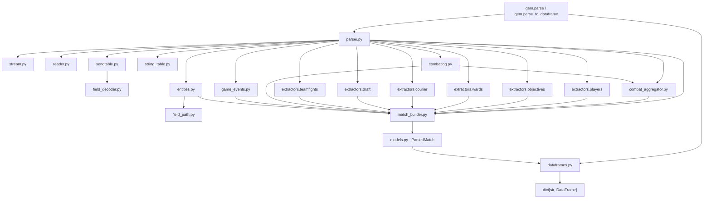
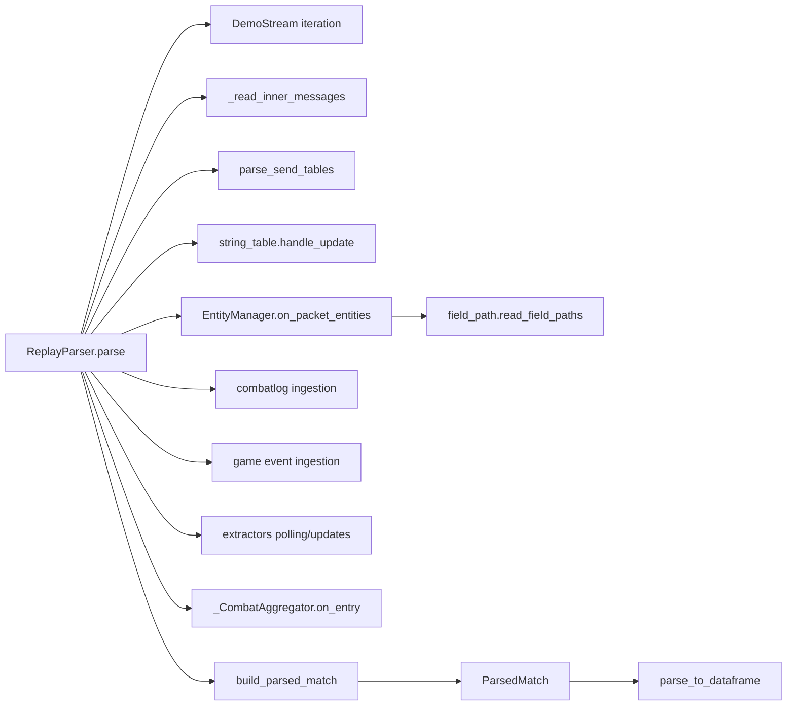
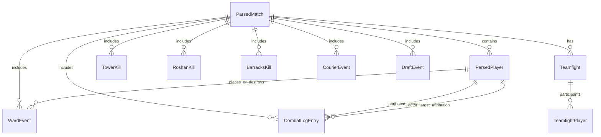

# Architecture

This document maps module interactions, key function flow, and core data relationships in `gem`.

## 1) Module Architecture and Data Flow

## 2) Key Function Interaction Flow

## 3) Data Model Relationships (ER View)

