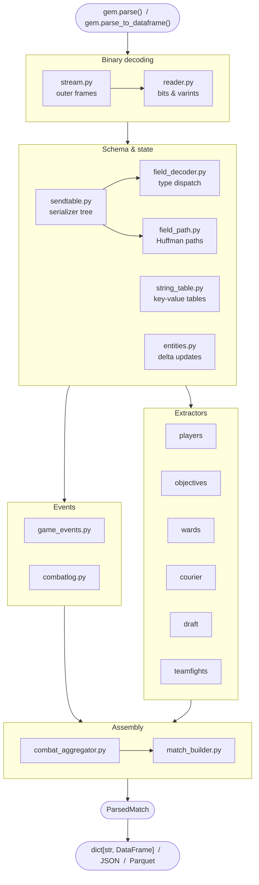

# Architecture

`gem` turns a raw `.dem` binary into structured Python objects in a single pass.
This page shows how the modules fit together and what each layer produces.

---

## Pipeline

---

## Layers at a glance

  

    Entry points
    

      gem.parse()
      gem.parse_to_dataframe()
      gem.parse_to_json()
      gem.parse_to_parquet()
    

  

  

    Binary decoding
    

      stream.py
      reader.py
      sendtable.py
      field_decoder.py
      field_path.py
      string_table.py
      entities.py
    

  

  

    Events
    

      game_events.py
      combatlog.py
    

  

  

    Extractors
    

      extractors/players.py
      extractors/objectives.py
      extractors/wards.py
      extractors/courier.py
      extractors/draft.py
      extractors/teamfights.py
    

  

  

    Assembly
    

      combat_aggregator.py
      match_builder.py
    

  

  

    Output
    

      models.py · ParsedMatch
      dataframes.py
    

  

---

## Output model

`gem.parse()` returns a single `ParsedMatch`. Every field is either a scalar or
a list of typed dataclasses — no raw dicts, no untyped payloads.

<table class="output-table">
  <thead>
    <tr>
      <th>Field</th>
      <th>Type</th>
      <th>What it contains</th>
    </tr>
  </thead>
  <tbody>
    <tr>
      <td><code>players</code></td>
      <td><code>list[ParsedPlayer]</code></td>
      <td>One entry per player — KDA, gold/XP series, purchases, runes, buybacks, positions</td>
    </tr>
    <tr>
      <td><code>draft</code></td>
      <td><code>list[DraftEvent]</code></td>
      <td>Chronological pick and ban events with hero name and team</td>
    </tr>
    <tr>
      <td><code>combat_log</code></td>
      <td><code>list[CombatLogEntry]</code></td>
      <td>Every damage, kill, heal, ability-use, and modifier event</td>
    </tr>
    <tr>
      <td><code>towers / barracks</code></td>
      <td><code>list[TowerKill / BarracksKill]</code></td>
      <td>Objective deaths with tick, team, and killer</td>
    </tr>
    <tr>
      <td><code>roshans</code></td>
      <td><code>list[RoshanKill]</code></td>
      <td>Roshan kills with kill number and killer slot</td>
    </tr>
    <tr>
      <td><code>tormentors / shrines</code></td>
      <td><code>list[TormentorKill / ShrineKill]</code></td>
      <td>Tormentor and Shrine of Wisdom destruction events</td>
    </tr>
    <tr>
      <td><code>wards</code></td>
      <td><code>list[WardEvent]</code></td>
      <td>Ward placements with exact map coordinates</td>
    </tr>
    <tr>
      <td><code>teamfights</code></td>
      <td><code>list[Teamfight]</code></td>
      <td>Detected fight windows with per-player damage, kills, and healing</td>
    </tr>
    <tr>
      <td><code>smoke_events</code></td>
      <td><code>list[SmokeEvent]</code></td>
      <td>Smoke activations with grouped heroes and centroid position</td>
    </tr>
    <tr>
      <td><code>aegis_events</code></td>
      <td><code>list[AegisEvent]</code></td>
      <td>Aegis pickups, steals, and denies</td>
    </tr>
    <tr>
      <td><code>courier_snapshots</code></td>
      <td><code>list[CourierSnapshot]</code></td>
      <td>Courier state sampled each tick</td>
    </tr>
    <tr>
      <td><code>chat</code></td>
      <td><code>list[ChatEntry]</code></td>
      <td>All-chat and team-chat messages</td>
    </tr>
    <tr>
      <td><code>radiant_gold_adv / radiant_xp_adv</code></td>
      <td><code>list[int]</code></td>
      <td>Per-minute Radiant gold and XP advantage curves</td>
    </tr>
  </tbody>
</table>

For the full field listing see the [Models reference](reference/models.md) and
[Full Match Data guide](guides/04_match_data.md).
